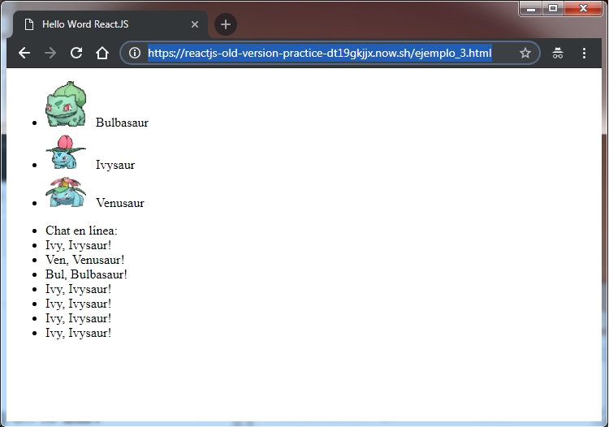

# ReactJS-old-version-practice
ReactJS version 0.13.3 from 2015, practice in the learning process. Based on a Platzi course.

## Run the project
* npm install
* npm run build
* Open 'ejemplo_3.html', the lastest functional 

## Global URL _powered by now_
* https://reactjs-old-version-practice-dt19gkjjx.now.sh/ejemplo_3.html

## Modest screenshot
